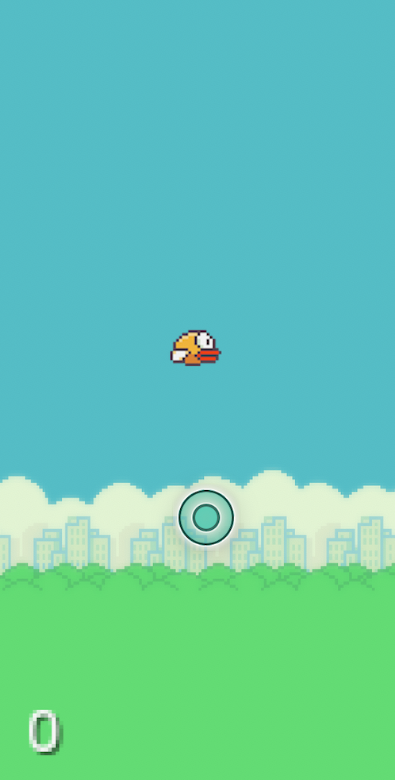

#  &nbsp; FlappyBird -

This project is an exact replica of the famous game [Flappy Bird](https://en.wikipedia.org/wiki/Flappy_Bird). The project uses Android Studio as the Integrated Development Environment and Lib GDX as its Game Engine. The programming language used is Java. The entire game has been built from scratch including the hurdles, the bird, the background etc. 

The software used for building the graphics was Adobe XD. This project was build as a part of Android App Development course provided by the startup company Golden Bird Learning Pvt. Ltd. It was used to teach engineering undergraduate students how to use LiB GDX to build a game on the android platform.

## Game Images -

 &nbsp; &nbsp;
 &nbsp; &nbsp;

 
